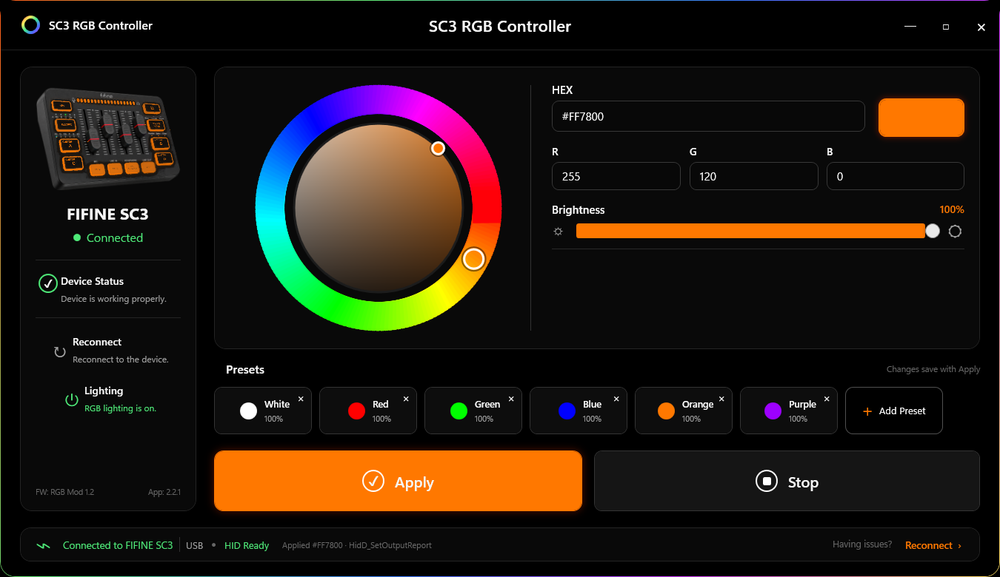

# FIFINE SC3 RGB+

FIFINE SC3 RGB+ is a Windows application that adds customizable RGB lighting
control to the FIFINE AmpliGame SC3 mixer.



## Features

- Custom RGB colors
- Color picker
- Brightness control
- Presets
- Lighting On/Off
- RGB effects
- Automatic SC3 detection
- Start with Windows
- Restore RGB state on startup
- Automatic RGB firmware setup for supported SC3 units
- Original SC3 button/status lighting preserved

## Supported hardware

FIFINE AmpliGame SC3.

This beta has been validated on the currently supported SC3 profile. The
included firmware modification is intended only for the FIFINE AmpliGame SC3.

## Installation

1. Download the latest `Setup.exe` from Releases.
2. Install FIFINE SC3 RGB+.
3. Connect the FIFINE SC3.
4. Launch the application.
5. If RGB setup is required, click **Enable RGB Control**.
6. Keep the SC3 connected until setup completes.
7. After reboot, RGB controls become available.

Firmware setup modifies the SC3 firmware. Do not disconnect the mixer while
firmware setup is running.

The beta installer is currently unsigned, so Windows SmartScreen may display a
warning.

## Firmware setup

The installer bundles the exact validated Mod 1.4 firmware used by the app.
When **Enable RGB Control** is selected, the app verifies the firmware by
SHA-256 before installation, runs the native updater, waits for the SC3 to
reboot, and verifies the Mod 1.4 attestation before reporting RGB Ready.

Users do not need to manually download or flash firmware files.

Firmware redistribution scope is documented in
[FIRMWARE_PERMISSION.md](FIRMWARE_PERMISSION.md).

## Build

Requirements: Windows, .NET 8 SDK, and Inno Setup 6.

Run:

```powershell
powershell -ExecutionPolicy Bypass -File .\scripts\build-release.ps1
```

The script builds the Windows app, native updater, and installer entirely from
this repository tree.

## License

Project source code is available under the [MIT License](LICENSE). The bundled
modified SC3 firmware is distributed under the permission documented above and
is not claimed as MIT-licensed project source.

## Unofficial project disclaimer

FIFINE SC3 RGB+ is an independent community project and is not affiliated with,
endorsed by, or supported by FIFINE.

FIFINE and AmpliGame are trademarks of their respective owner.
